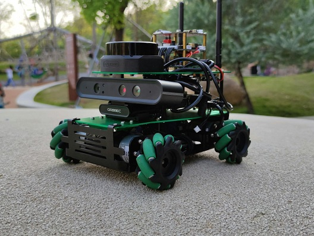
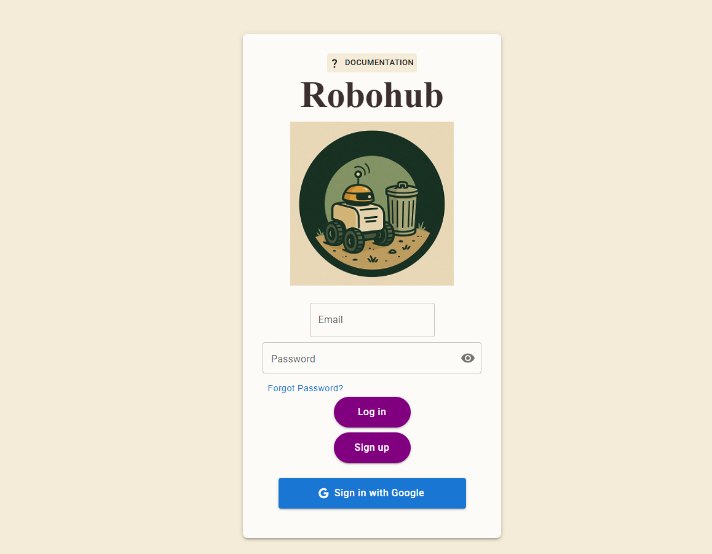
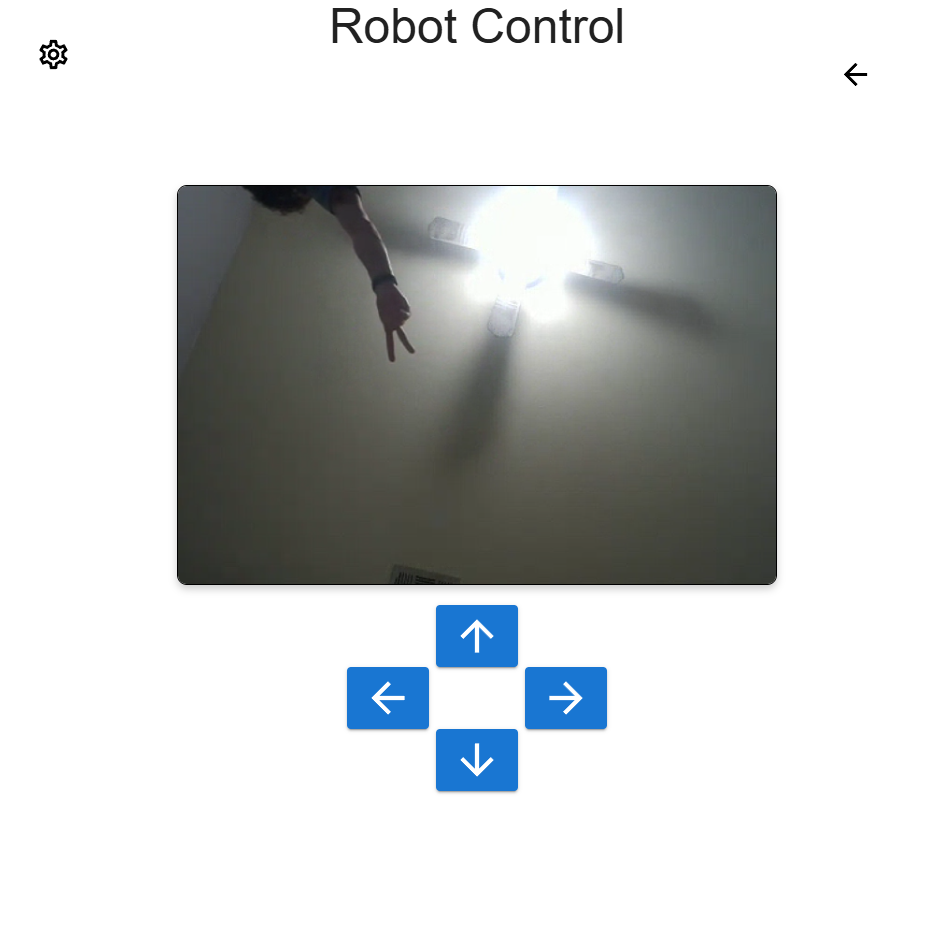
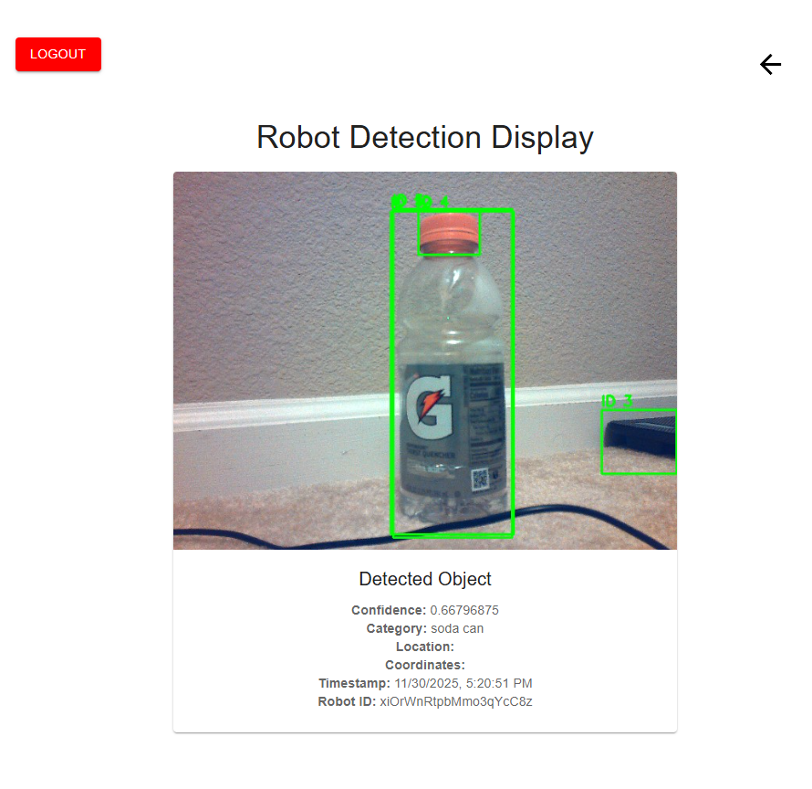
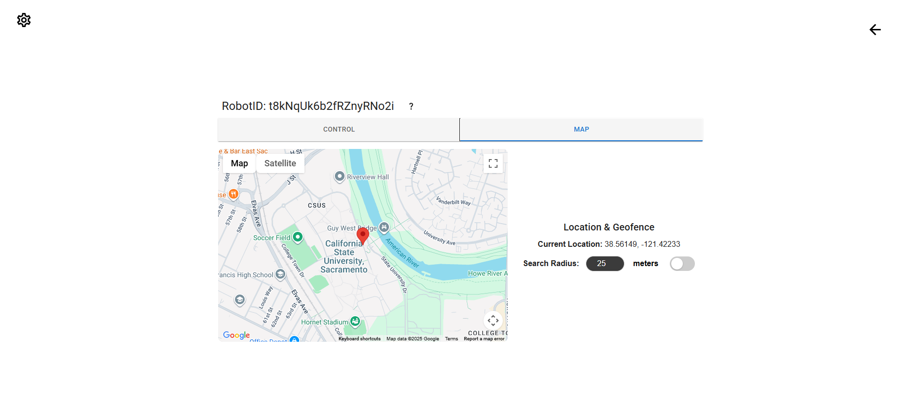
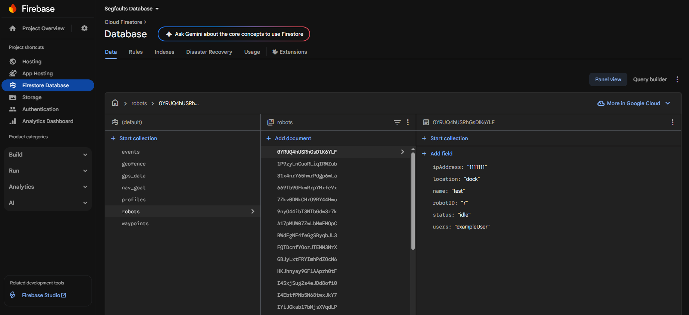

# Segfaults - Trash Finding Robot Application

<h1 align="center">

  

</h1>
<h1 align="center">

  

</h1>

Welcome to the **Trash Finding Autonomous Robot Project**, developed by the Segfaults senior project team at Sac State. This repository contains the codebase for a web application and robot scripts that together can manage a fleet of trash-finding robots. The framework is designed to work best with the **Yahboom Rosmaster X3** platform and other Linux SBC-based robots (e.g., Raspberry Pi 5), allowing multiple robots to scan large environments such as a university campus for litter or other objects of interest.

---

## 🤠	 Project Overview

Our Project features a web app which includes user management, presents data gathered from the robot, and allows access/control to the Linux microcomputer-based robots. These robots take advantage of AI image processing, lidar and GPS to recognise litter or potentially other objects of interest in order to enable a scan of a large area, such as many buildings in a school campus. The robots will detect objects of interest in real time and store this as an event in a Firebase backend, which can be accessed from the web app. 

---

## ✨ Key Features

### Web App

<h1 align="center">

  

</h1>

- **Real-Time Monitoring**: Track the robot's status, location, and trash detection events.
- **Remote Control**: Navigate the robot via an intuitive React-based interface.
- **Trash Visualization**: Display detected trash locations using Leaflet map integration.
- **User Authentication**: Secure access through Firebase authentication.
- **Data Management**: Store and retrieve robot data using Firestore.

### Robot Scripts
- **Camera Integration**: Integrates the onboard camera with the robot's single-board computer to enable the capturing and processing of videos.
<h1 align="center">

  

</h1>

- **Object Detection**: Utilizes the YOLO algorithm to scan a live feed video for litter in the robot's environment.
<h1 align="center">

  

</h1>

- **Navigation**:
  - Motor scripts are used to move the robot.
  - Autonomous obstacle avoidance is implemented through data received from a Lidar.

<h1 align="center">

  

</h1>

---
- **Movement Tracking**: Utilizes a GPS module to keep track of the robot's location.
- **Cloud Connectivity**: Live video feed data is streamed to a website for real-time updates.

---

## 🛠️ Technologies Used

### Web Application
- **Frontend**:
  - React + Vite
  - Google Maps and Routes API
  - Firebase Authentication
- **Backend**:
  - Firebase Firestore with cloud storage buckets enabled (for data storage)

<h1 align="center">

  

</h1>


### Robot Scripts
- **Languages**:
  - Python
- **Libraries & Frameworks**:
  - ROS2 (Robot Operating System)
  - WebRTC
  - OpenCV
  - YOLO (for Image Detection)
  - Flask (for communication with robot and app)
---
## 🚀 Deployment
This project has two major deployment targets:

1. The **web application** (React + Vite) deployed to **Firebase Hosting**
2. The **robot software** (ROS2 + Docker) deployed to a Yahboom Rosmaster X3 or similar robot

Prerequisites: \
Node.js (LTS or later) \
npm (comes with Node) \
git

Check your versions:
```bash
git --version
node -v
npm -v
```

## Steps for web application
1. Clone the repository and install dependencies
```bash
git clone https://github.com/sashawasha1337/Segfaults.git
cd Segfaults/ReactApp
npm install
```
2. Configure Firebase environment variables
Inside ReactApp, create a .env.local file:
```bash
touch .env.local
```
Add your Firebase config (replace with your project’s values):
```bash
VITE_FIREBASE_API_KEY=<your-api-key>
VITE_FIREBASE_AUTH_DOMAIN=<your-project-id>.firebaseapp.com
VITE_FIREBASE_PROJECT_ID=<your-project-id>
VITE_FIREBASE_STORAGE_BUCKET=<your-project-id>.appspot.com
VITE_FIREBASE_MESSAGING_SENDER_ID=<your-sender-id>
VITE_FIREBASE_APP_ID=<your-app-id>
```
>You must configure your Firebase account to support cloud storage to have the **VITE_FIREBASE_STORAGE_BUCKET** endpoint  
>follow this link for information on how to do this: https://firebase.google.com/docs/storage/web/start  

3. Login and initialize Firebase
```bash
firebase login
firebase init
```
During firebase init:
- Choose Hosting
- Select your existing Firebase project
- Set the public directory to dist
- Choose “Single-page app” if prompted
- Do not overwrite index.html if you already have one

4. Build and deploy
```bash
npm run build   # builds the production bundle into /dist
firebase deploy # deploys to Firebase Hosting
```
After this, Firebase will give you a hosting URL where the web app is live.

## Steps for robot software
1. Pull the code onto the robot
SSH into the robot or open a terminal:
```bash
cd ~
git clone https://github.com/sashawasha1337/Segfaults.git
cd Segfaults/RobotScripts
mkdir -p ~/ros2_ws
cp -r . ~/ros2_ws
cd ~/ros2_ws
colcon build
source /opt/ros/eloquent/setup.bash
source install/setup.bash
echo "source /opt/ros/eloquent/setup.bash" >> ~/.bashrc
echo "source ~/ros2_ws/install/setup.bash" >> ~/.bashrc
```

> Refer to the following google drive for documentation on how to set up your Cloud Firestore for storing robot data, how to set up the Tailscale, and more.
> https://drive.google.com/drive/folders/1vn-iZhwrVsGYErsjkHZxbloHrBwzLBWV?usp=sharing


2. Configure Firebase service account on the robot
In the Firebase Console, generate a service account key:
Project Settings → Service Accounts → “Generate new private key”
Rename the downloaded JSON to:
```bash
robot-service-account.json
```
Copy it onto the robot into ~/ros2_ws (and any other path your Docker command expects, such as src/camera/camera).

3. Build YOLO/Camera Docker image
From the robot:
```bash
cd ~/ros2_ws
sudo docker build -t nano-ros-foxy-yolo -f docker/Dockerfile .
```
Run the container (update FIREBASE_STORAGE_BUCKET and paths as needed):
```bash
sudo docker run -it --rm \
  --memory=1g \
  --memory-swap=4g \
  --runtime nvidia \
  --network host \
  --ipc=host \
  --device /dev/video0:/dev/video0 \
  -v /tmp/.X11-unix:/tmp/.X11-unix:rw \
  -e DISPLAY=$DISPLAY -e QT_X11_NO_MITSHM=1 \
  -e ROS_DOMAIN_ID=0 \
  -e RMW_IMPLEMENTATION=rmw_fastrtps_cpp \
  -e ROS_LOCALHOST_ONLY=0 \
  -e FIREBASE_STORAGE_BUCKET="your-storage-bucket.app" \
  -e ROBOT_ID="$(hostname)" \
  -e ROBOT_UID="$(hostname)" \
  -v "$PWD/src:/ros2_ws/src:rw" \
  -v "$PWD/robot-service-account.json:/ros2_ws/secrets/robot-service-account.json:ro" \
  -v "$PWD/Model:/Model:ro" \
  -v ros2_build:/ros2_ws/build \
  -v ros2_install:/ros2_ws/install \
  -v ros2_log:/ros2_ws/log \
  nano-ros-foxy-yolo:latest
```
This container runs the YOLO/DeepSort object detection pipeline and pushes detections/images to Firebase.

4. Run Nav2/robot launch files
SSH into the robot:
```bash
ssh <robot-ip>
```
Source the workspace:
```bash
cd ~/ros2_ws
source /opt/ros/eloquent/setup.bash
source install/setup.bash
```
Launch the appropriate file for your hardware (GPS/Lidar config):
```bash
ros2 launch robot_launch <launch-file>
```
Once the robot is running and connected (often via Tailscale), the web app will be able to show its status, stream video, display detections, and send navigation commands.

---

## 🖥️ Testing 
We have developed automated software tests for both the web application and the robot. These are crucial for testing changes made to production code, ensuring they do not lead to critical errors when deployed. 
- **Web App Testing**
- 
<h1 align="center">

  

</h1>

  - We use Vitest for automated testing of the React web pages and components. 
Navigate to the ReactApp Directory
```bash
cd Segfaults/ReactApp
```
Run all tests
``` bash
npm run test
```

- **Robot Testing**
  - We use Pytest for unit ant integration testing of ROS2 nodes.
Navigate to the testing ROS2 workspace
```bash
cd ~/ros2_ws/Robotscripts/test
```
Run unit tests
```bash
pytest unit_tests/ -v
```
Run integration tests
```bash
Pytest integration_tests/ -v
```

---

#### Firestore Entity Relationship Diagram 


---

## 📧 Contact

For inquiries or feedback, reach out to the project team at **[sashayasinericsaaed@csus.edu]**.

---


