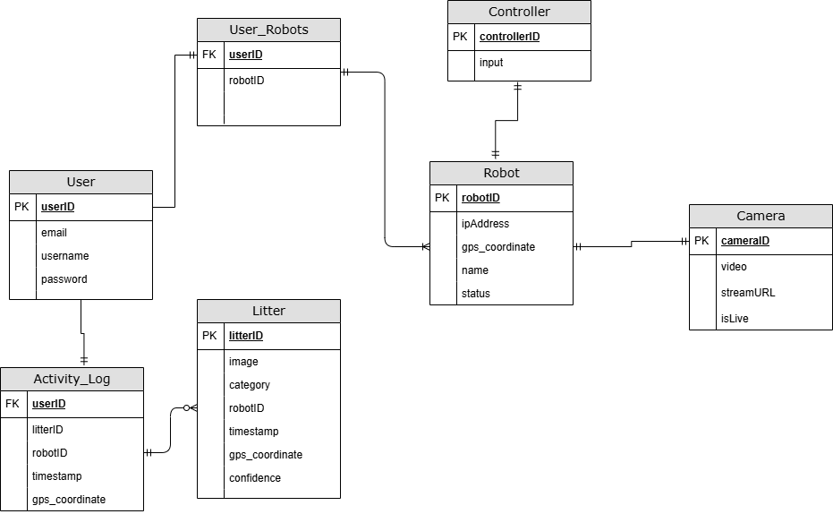

# Segfaults - Trash Finding Robot Application

<h1 align="center">
   
  
   
</h1>
<h1 align="center">
   
  
   
</h1>

Welcome to the **Trash Finding Autonomous Robot Project**, developed by the segfaults senior project team at sac state. This repository contains the codebase for a web application and robot scripts that together can manage a fleet of trash-finding robots. 

---

## 🤠	 Project Overview

Our Project features a web app which includes user management and presents data from and allows access to Linux microcomputer based robots. These robots take advantage of AI image processing, lidar and GPS to recognize litter or potentially other objects of interest in order to enable a scan of a large area such as many buildings in a school campus. The robots will detect objects of interest in real time and store this as an event in a firebase backend, which can be accessed from the web app. 

---

## ✨ Key Features

### Web App
- **Real-Time Monitoring**: Track the robot's status, location, and trash detection events.
- **Remote Control**: Navigate the robot via an intuitive React-based interface.
- **Trash Visualization**: Display detected trash locations using Leaflet map integration.
- **User Authentication**: Secure access through Firebase authentication.
- **Data Management**: Store and retrieve robot data using Firestore.

### Robot Scripts
- **Camera Integration**: Integrates the onboard camera with the robot's single-board computer to enable the capturing and processing of videos.
- **Object Detection**: Utilizes the YOLO algorithm to scan a live feed video for litter in the robot's environment.
- **Navigation**:
  - Motor scripts are used to move the robot.
  - Autonomous obstacle avoidance is implemented through data received from a Lidar.
- **Movement Tracking**: Utilizes a GPS module to keep track of the robot's location.
- **Cloud Connectivity**: Live video feed data is streamed to a website for real-time updates.

---

## 🛠️ Technologies Used

### Web Application
- **Frontend**:
  - React + Vite
  - Leaflet (for maps)
  - Firebase Authentication
- **Backend**:
  - Firebase Firestore (for data storage)

### Robot Scripts
- **Languages**:
  - Python
- **Libraries & Frameworks**:
  - ROS2 (Robot Operating System)
  - WebRTC
  - OpenCV
  - YOLO (for Image Detection)
  - Flask (for communication with robot and app)
---
## 🚀 Deployment

## 🖥️ Testing 

## 👽 Developer instructions

## 📅 Timeline

---

#### Data ERD 

---

## 📧 Contact

For inquiries or feedback, reach out to the project team at **[sashayasinericsaaed@csus.edu]**.

---

